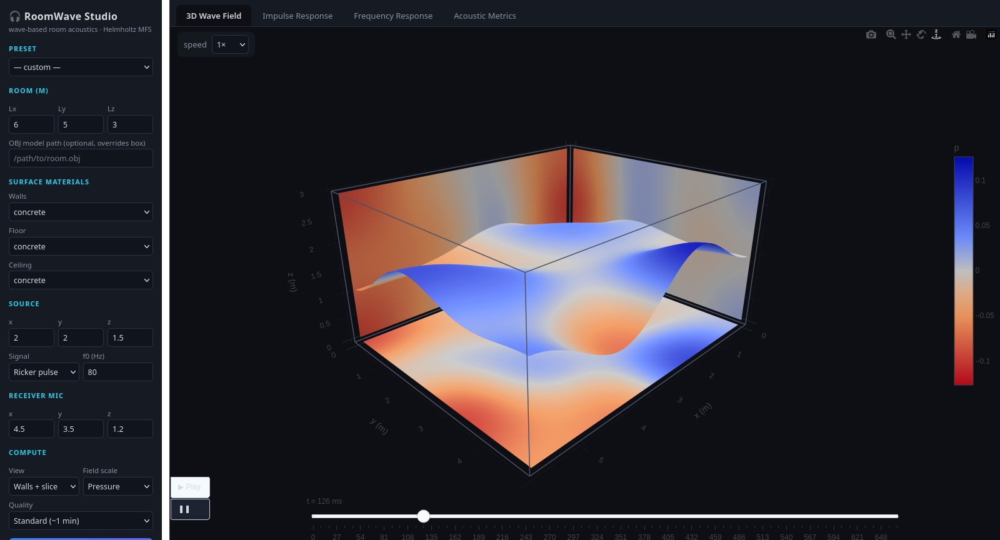
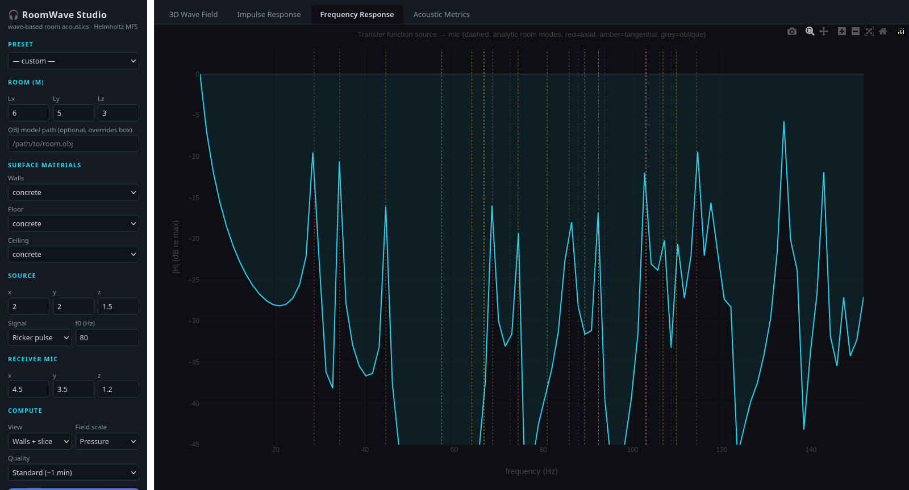
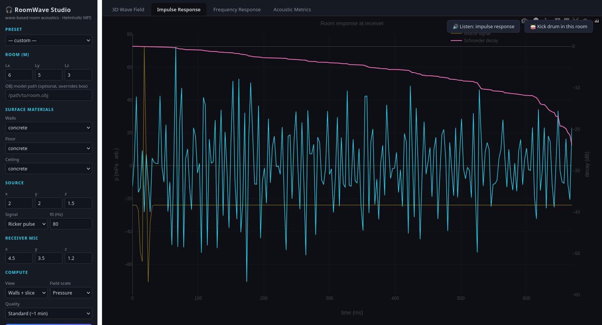

# RoomWave Studio

**Wave-based 3D room acoustics analyzer** — simulate how sound from a speaker
propagates, reflects, and resonates inside a room, in your browser, on a
laptop.



Below the Schroeder frequency of a room, sound does not behave like rays — it
behaves like waves: standing waves, modal resonances, boomy corners, dead
spots. Ray/image-source tools (the classic geometric acoustics programs) are
invalid there. RoomWave Studio solves the actual **Helmholtz wave equation**
in 3D — the same wave-based approach used by modern commercial solvers for
the low-frequency band — with a lightweight numerical engine that runs
interactively on ordinary hardware.

Also in this repository: the original **elastodynamic scattering solver**
(`core/tdbem.py`) this project grew from — P-wave scattering off a rigid
sphere with the dynamic Kelvin/Stokes fundamental solution (see history at
the bottom).

---

## Quick start

Requirements: Python 3.10+, `numpy`, `plotly` (for the bundled plotly.js).
No web framework needed — the server is Python's standard library.

```bash
cd core
python app.py
# open http://localhost:8747
```

Pick a preset (living room / studio / bathroom / hall / stereo pair), press
**Simulate**, and explore the four tabs.

## What it does

| | |
|---|---|
| **3D wave field** | Animated sound pressure on a room cutaway (floor + two walls + a slice), in pascals or absolute dB SPL, with playback speed, colormap and relief controls |
| **Impulse response** | Pressure at a receiver mic, Schroeder decay curve, spectrogram, and **auralization** — listen to the IR, or a kick drum / clap convolved through the simulated room (WebAudio) |
| **Frequency response** | Source→mic transfer function with the analytic room modes overlaid (axial / tangential / oblique), ⅓-octave smoothing, A/B overlay of the previous run |
| **Acoustic metrics** | ISO 3382-style: RT60 three ways (Sabine, Eyring, and T20 measured from the simulated IR by Schroeder integration), EDT, C50, C80, D50, Schroeder frequency, per-band RT60, mode table — with deltas against your previous run |



### Physically calibrated

The source is a real speaker: you set its **level at 1 m in dB SPL**
(50–110 dB) and every output is in physical units — pascals in the field
view, absolute dB SPL in the SPL view, dB re 20 µPa at the mic. A speaker at
85 dB @ 1 m reads ≈ 78–79 dB at a mic 3 m away in a live room, matching
direct-field + reverberant theory.

### Two source modes

- **Speaker tone (steady state)** — a continuously playing tone: one
  Helmholtz solve (~1 s), animated as a seamless loop. With the SPL scale
  this shows the **standing-wave map** of the room — bright antinodes, dark
  nodes — the map you want for subwoofer/listener placement. Try setting f0
  to a mode frequency from the metrics table.
- **Pulses** (Ricker / tone burst / click / chirp) — broadband transients:
  watch wavefronts leave the speaker, reflect, and decay into reverberation;
  gives the impulse response, transfer function, and decay metrics.

### Rooms and materials

- Box rooms of any size, or an arbitrary **closed triangle mesh** (`.obj`)
- Per-surface materials (walls / floor / ceiling) from published octave-band
  absorption tables: concrete, brick, ceramic tile, glass, gypsum drywall,
  wood floor, carpet, heavy curtain, acoustic panel, ceiling tile, open window
- One or two sources — the stereo pair supports **anti-phase** polarity to
  study cancellation and interference



## How it works (short version)

Frequency-domain **Method of Fundamental Solutions** (a desingularized
boundary-element method): for each FFT bin of the source signal, fictitious
monopoles placed *outside* the room are fitted so the total field satisfies
the locally-reacting impedance boundary condition
`∂p/∂n + ik β(f) p = 0` on the walls, where `β(f)` is derived per surface
from the material's absorption coefficient `α(f)`. The per-frequency
solutions are assembled back to the time domain by inverse FFT —
unconditionally stable, no time-marching, no singular integration.

Full formulation, calibration, metrics definitions, verification results and
limitations: **[docs/PHYSICS.md](docs/PHYSICS.md)**.
UI walkthrough and Python API: **[docs/USER_GUIDE.md](docs/USER_GUIDE.md)**.

### Verification

`python core/acoustics.py --selftest` (all passing):

1. Green's function satisfies the Helmholtz equation (finite differences, ~3e-9)
2. Rigid-wall boundary-condition residual on independent points (~1e-2)
3. Absorbing walls kill the late reverberant energy vs rigid walls
4. **Modal accuracy** — resonance at the analytic axial mode `c/2Lx`
   (42.9 Hz), 6× above neighbouring frequencies

Live cross-checks: simulated FRF peaks land on the analytic mode lines;
RT60 measured from the simulated impulse response (T20 = 0.79 s) agrees with
the independent statistical predictions (Sabine 0.94 s, Eyring 0.88 s) for a
6×5×3 m brick/wood/drywall room. Every run reports its boundary-condition
residual in the status panel — the honesty number.

### Limitations (read this)

- **Low-frequency band by design.** The resolvable band is set by the wall
  point budget (~6 points per wavelength): ≈110 Hz (preview), ≈155 Hz
  (standard), ≈190 Hz (high). This covers the modal region where wave
  effects dominate. Above the Schroeder frequency, geometric methods are the
  right tool — a hybrid is the standard commercial architecture.
- Locally-reacting impedance walls (standard, but an approximation);
  normal-incidence α→β conversion; no air absorption (negligible < 1 kHz);
  empty rectangular or user-meshed rooms — no furniture scattering.
- Dense linear algebra: O(N³) per frequency. Larger rooms / higher bands
  need FMM or ℋ-matrix acceleration (roadmap).

## Repository layout

```
core/acoustics.py   physics engine (Helmholtz MFS, materials, metrics) + self-tests
core/app.py         RoomWave Studio web app (stdlib http.server + Plotly.js)
core/tdbem.py       elastodynamic MFS solver (P-wave scattering, phase 1)
docs/PHYSICS.md     formulation, calibration, metrics, verification
docs/USER_GUIDE.md  UI walkthrough, presets, Python API, troubleshooting
```

## Project history

This project began as **P-wave scattering** research (hence the repository
name): time-domain elastic wave scattering for seismic site-effect analysis.
Phase 1 — transient scattering of a Ricker P-wave pulse off a rigid sphere
using the dynamic Kelvin/Stokes fundamental solution — is preserved and
verified in `core/tdbem.py`. The acoustic analyzer reuses the same verified
architecture (frequency-domain MFS + inverse FFT) with scalar kernels.

## License

Research code, provided as-is. If you use it in academic work, a citation of
this repository is appreciated.
